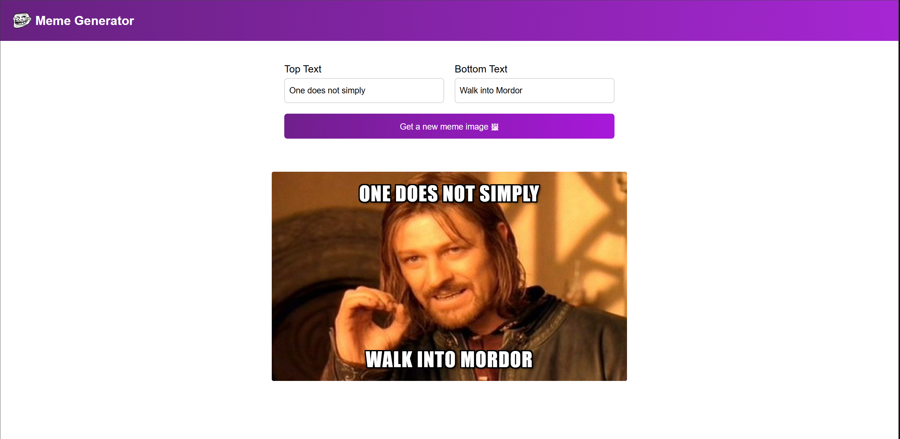

# 😂 Meme Generator

A simple and interactive **Meme Generator** built with **React and Vite**. The application fetches popular meme templates from the Imgflip API and allows users to customize the text displayed on their memes.

## ✨ Features

* 🖼️ Fetches meme templates dynamically from the Imgflip API
* 🔤 Customize top and bottom meme text
* 🎲 Generate a random meme image
* ⚛️ Built using React functional components and hooks
* 🔄 Dynamic state updates using React `useState`
* 🌐 API data fetching using `useEffect` and the Fetch API
* 📱 Simple and responsive user interface

## 🛠️ Tech Stack

* **React**
* **JavaScript**
* **Vite**
* **CSS**
* **Imgflip API**

## 🧠 React Concepts Practiced

This project helped me practice:

* `useState` for managing component state
* `useEffect` for fetching API data
* Controlled form inputs
* Event handling
* Dynamic object properties
* Fetch API and JSON parsing
* Rendering dynamic data
* Updating state based on previous state
* Working with external APIs

## 🎮 How It Works

1. The application fetches available meme templates from the **Imgflip API** when the component loads.
2. Enter text in the **Top Text** and **Bottom Text** fields.
3. Click **Get a new meme image**.
4. A random meme template is selected from the available templates.
5. The selected image is displayed with the entered text.

## 🚀 Getting Started

### Prerequisites

Make sure you have **Node.js** and **npm** installed.

### Installation

Clone the repository:

```bash
git clone https://github.com/furqhan24/meme-generator.git
```

Navigate to the project directory:

```bash
cd meme-generator
```

Install dependencies:

```bash
npm install
```

Start the development server:

```bash
npm run dev
```

Open the local URL provided by Vite in your browser.

## 🌐 API

This project uses the **Imgflip API** to retrieve meme templates:

```text
https://api.imgflip.com/get_memes
```

No API key is required for retrieving the meme templates used by this application.

## 📸 Preview



## 🔮 Future Improvements

* Add the selected text directly on top of the meme image
* Add text styling and positioning controls
* Add meme download functionality
* Add loading and error states
* Add mobile-friendly styling
* Allow users to upload their own images
* Add more customization options

## 📚 Learning

This project was built as part of my journey learning **React**, with a focus on state management, controlled inputs, React hooks, API integration, and dynamic user interfaces.

---

